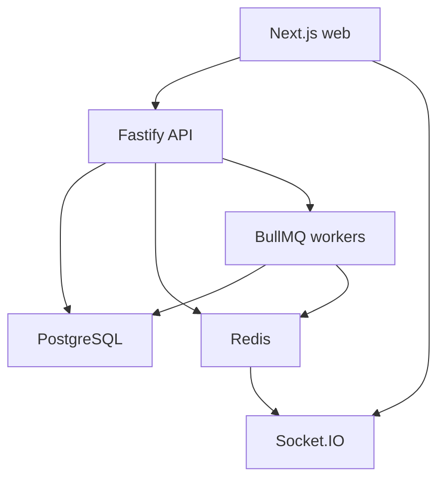
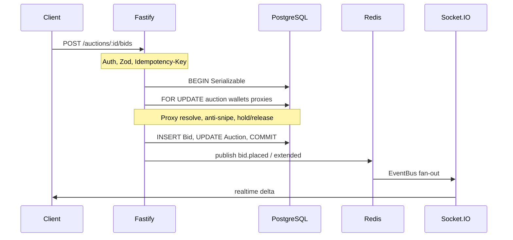
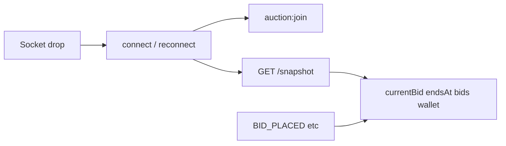

# System Design — Lotforge

This document records **architectural decisions and trade-offs** for the real-time auction platform. For bootstrap and scripts, see [README.md](../README.md). For integration tests, see [TESTING.md](TESTING.md).

## 1. Overview

Lotforge is a pnpm monorepo for high-concurrency live auctions with escrow holds, proxy bidding, and anti-sniping.

| Package / app | Role |
|---------------|------|
| `apps/api` | Fastify REST API, Socket.IO, BullMQ workers (in-process) |
| `apps/web` | Next.js 15 App Router + Tailwind client |
| `packages/db` | Prisma schema, migrations, `SELECT … FOR UPDATE` helpers |
| `packages/shared` | Zod schemas, DTOs, realtime event contracts |
| `packages/config` | Shared TypeScript / ESLint config |

**Infrastructure (docker compose):** PostgreSQL 16, Redis 7, Mailhog (SMTP).

## 2. High-level architecture

- **PostgreSQL** is the source of truth for auctions, bids, wallets, and identity.
- **Redis** is used for Socket.IO adapter pub/sub, EventBus fan-out, rate limiting, and BullMQ.
- **BullMQ** runs the auction-closer tick and email jobs inside the API process (`apps/api/src/index.ts`).

## 3. Bid critical path

Primary code: [`apps/api/src/services/bidding.ts`](../apps/api/src/services/bidding.ts), [`packages/db/src/locks.ts`](../packages/db/src/locks.ts).

### Steps

1. **Auth + validation** — buyer role; amount validated against current floor via Zod factory.
2. **Idempotency** — optional `Idempotency-Key` header keyed by `(key, userId)`; replays return the same `bidId` without double hold.
3. **Serializable transaction + pessimistic locks** — lock auction row, proxy bids for the lot, then wallets in sorted `userId` order (deadlock avoidance).
4. **Domain logic** — classic proxy resolution; if within anti-snipe window, extend `endsAt` in the same transaction.
5. **Escrow** — release previous winner hold (if any), hold for new visible winning amount.
6. **After commit** — publish to Redis EventBus only; each API process subscriber emits once to Socket.IO rooms (`auction:{id}`, and for bids also `seller:{sellerId}`; wallet updates go to `user:{id}`). Local `emitLocal` is not called from `publish` (avoids double delivery).

Concurrency safety comes from **row locks inside one DB transaction**, not from Redis locks or optimistic-only `version` checks on the bid path (`version` still increments for observers).

## 4. Realtime and reconnect

Primary code: [`apps/api/src/realtime/event-bus.ts`](../apps/api/src/realtime/event-bus.ts), [`apps/web/src/lib/use-auction-socket.ts`](../apps/web/src/lib/use-auction-socket.ts), `GET /auctions/:id/snapshot`.

### Authority model

| Channel | Role |
|---------|------|
| PostgreSQL | Source of truth |
| Socket.IO events | Low-latency deltas after commit |
| `GET /auctions/:id/snapshot` | Catch-up after connect / reconnect |

On mount, `connect`, and Socket.IO `reconnect`, the client refetches the snapshot and clears optimistic UI state when authoritative data arrives.

**Why not full CQRS / event sourcing yet:** `Bid` is already append-only; `Auction.currentBid` / `currentWinnerId` / `endsAt` are denormalized for hot reads. A Redis read-model can be added later if Postgres read load becomes the bottleneck. Until then, snapshot + delta keeps one truth source and simpler ops.

## 5. Wallet and escrow

Primary code: [`apps/api/src/services/wallet.ts`](../apps/api/src/services/wallet.ts).

- Balances are integer **minor units** (kuruş/cents) — never floating point.
- Split ledger: `availableBalance` vs `heldBalance`.
- Mutations write an immutable `WalletTransaction` row (`balanceAfter` / `heldAfter` snapshots).
- Bid path uses nested `*InTx` helpers under the auction transaction.
- Settlement (`endAndSettleAuction`): if reserve met and there is a winner, `CAPTURE` reduces buyer held and credits seller available; otherwise holds are released and the lot ends without settlement.

## 6. Distributed closing

Primary code: [`apps/api/src/queues/auction-closer.ts`](../apps/api/src/queues/auction-closer.ts).

- A BullMQ **repeatable job every 1s** scans `LIVE` auctions with `endsAt <= now` and calls `endAndSettleAuction` (which re-checks under `FOR UPDATE`).
- Also promotes `SCHEDULED → LIVE` and enqueues ending-soon emails (deduped by BullMQ `jobId`).

**Trade-off:** polling is simpler than per-lot delayed jobs and survives process restart (job lives in Redis). Cost is up to ~1s close latency. Anti-snipe extensions persist in PostgreSQL `endsAt`, so a crash does not lose the extended deadline. Per-auction delayed close jobs remain a future optimization.

Note: `package.json` still has a `worker` script pointing at `src/worker.ts`, but workers today start **inside** the API process. A separate worker entrypoint is not implemented yet.

## 7. Observability

| Endpoint | Auth | Purpose |
|----------|------|---------|
| `GET /health` | Public | `{ ok, postgres, redis }` for load balancers / compose |
| `GET /admin/metrics` | Admin | Sockets, Redis/Postgres latency, wallet sums, live/ending-soon counts, BullMQ job counts |

Admin UI (`/admin`) polls metrics every ~8s and shows compact health cards. See [TESTING.md](TESTING.md) for metrics auth tests.

## 8. Trade-offs

| Decision | Chose | Rejected / deferred | Why |
|----------|-------|---------------------|-----|
| Bid concurrency | PostgreSQL `FOR UPDATE` + `Serializable` | Redis distributed locks / Redlock | Same store as balances; atomic escrow + bid; no split-brain between lock and ledger |
| Event history | Append-only `Bid` + auction snapshot columns | Full event sourcing + CQRS read models | Enough for audit and UI; lower ops cost until scale forces projections |
| Client sync | Snapshot + Socket deltas | Socket-only or dual SSE/polling truth | Reconnect safety without two competing authorities |
| Auction close | BullMQ 1s tick | In-memory `setTimeout` or only delayed jobs | Survives restarts; simple; ~1s skew acceptable |
| Workers | In-process with API | Separate `src/worker.ts` process | Fewer moving parts for MVP; scale-out can split later |
| Rate limits | Global Fastify limit + per-(user, lot) Redis token bucket (capacity 3, refill 1/2s) on `POST /bids` and `PUT /proxy-bid` | Unbounded bid spam | Stops micro-spam without blocking other lots; global limit remains a second line |
| Realtime transport | Socket.IO (WS + polling fallback) | Custom SSE + HTTP poll stack | Built-in fallback; Redis adapter for multi-instance |

## 9. Security notes (brief)

- Access/refresh JWTs in HTTP-only cookies; Socket.IO auth reuses the access cookie.
- Sellers cannot bid on their own lots (`SELF_BID`).
- Admin force-end / force-cancel require a reason and write audit logs.
- Uploads are size-limited; static files served from a configured upload dir.

## Related realtime notes

- Socket.IO: optional auth (guest read-only auction rooms); JWT cookie attaches user room for wallet events.
- `GET /auctions/:id/proxy-bid` — buyer’s current proxy max (nullable).
